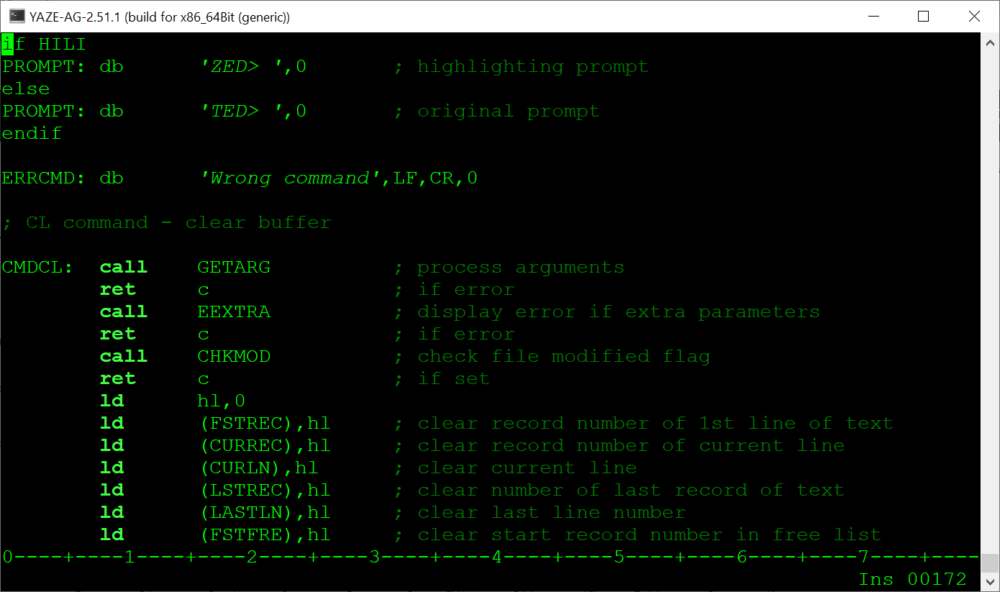

# Introduction

ZED is a fork of TED that adds Zilog Z80 assembly syntax highlighting to TED.
TED is a clone of the editor of the same name that once was available for the
DEC's RT-11 OS.

# Building ZED

Open TED.INC in a text editor and check that HILI is set to TRUE.

Then, set HILIAR to TRUE or FALSE depending on system performance.
- TRUE if automatic refresh of syntax highlighting
- FALSE if manual refresh of screen and the syntax highlighting

Submit the MKZED.SUB file, let M80 assemble and let L80 link to get ZED.COM.

# ZED functionality

- ; A comment like this is displayed with low intensity.
- "A string like this is displayed in italics".
- 'A string like this is also displayed in italics'.
- Zilog Z80 mnemonics are case insensitive and displayed with high intensity.

# ZED performance

The syntax highlighting in ZED slightly reduces performance compared to TED.
My tests with ZED in the YAZE-AG Z80 emulator shows that ZED can be used even
if the Z80 CPU frequency is set as low as 4 MHz.
